# LINE HR AI Agent Platform — Database Design (Phase 0)

> Multi-tenant SaaS. **โมเดล LINE: OA ต่อบริษัท** (แต่ละ tenant เชื่อม LINE OA ของตัวเอง)
> Stack: Supabase PostgreSQL + Auth · RLS เปิดทุกตาราง · Soft delete · Audit logs

---

## 1. หลักการออกแบบ (อ่านก่อน)

### 1.1 ทุกตารางหลักมีคอลัมน์มาตรฐาน
```
id          uuid  PK  default gen_random_uuid()
tenant_id   uuid  FK -> tenants(id)        -- (ยกเว้น tenants, system_settings)
created_at  timestamptz default now()
updated_at  timestamptz default now()      -- อัปเดตด้วย trigger
created_by  uuid (employee/user id)        -- nullable (งานจาก LINE อาจไม่มี user)
updated_by  uuid
deleted_at  timestamptz                    -- soft delete (NULL = ยังอยู่)
```

### 1.2 Tenant isolation — 3 ชั้น (อย่าพึ่ง RLS ชั้นเดียว)
1. **RLS** บนทุกตาราง: `tenant_id = app.current_tenant_id()`
2. **App-layer guard**: ทุก query ฝั่ง server แนบ `tenant_id` เสมอ
3. **Runtime role แยก**: งานจาก webhook/cron ใช้ Postgres role `tenant_runtime`
   (ไม่มี `BYPASSRLS`) + `SET LOCAL app.tenant_id = '<uuid>'` ต่อ transaction
   → service_role ของ Supabase มี BYPASSRLS อย่าใช้กับ request ของผู้ใช้

`app.current_tenant_id()` อ่าน `tenant_id` จาก JWT claim ก่อน ถ้าไม่มี fallback ไป GUC
`app.tenant_id` (สำหรับ background jobs) — ดู `0003_rls.sql`

### 1.3 LINE identity — ทำไม (tenant_id, line_user_id) ปลอดภัย
LINE `userId` ถูก scope ต่อ **provider/channel** แต่ละ tenant ใช้ OA ของตัวเอง (คนละ provider)
→ คนเดียวกันที่ทำ 2 บริษัท ได้ `line_user_id` คนละค่าโดยอัตโนมัติ → ไม่มี collision ข้าม tenant
→ unique constraint คือ `(tenant_id, line_user_id)` ไม่ใช่ `line_user_id` เดี่ยว

### 1.4 Running number — กัน race ด้วย atomic upsert
ไม่ใช้ `MAX()+1` (ชนกันได้) ใช้ตาราง `running_number_counters` + `INSERT ... ON CONFLICT
DO UPDATE` ใน function `app.next_doc_number()` แยก counter ตาม `(tenant_id, sequence_key, period_key)`

| เอกสาร | prefix | period | ตัวอย่าง |
|--------|--------|--------|----------|
| Employee | EMP | ปี (YYYY) | `EMP-2026-0001` |
| Leave | LEV | วัน (DDMMYYYY) | `LEV-11062026-0001` |
| OT | OT | วัน | `OT-11062026-0001` |
| Attendance | ATT | วัน | `ATT-11062026-0001` |
| Document | DOC | วัน | `DOC-11062026-0001` |

### 1.5 Timezone
เก็บทุก timestamp เป็น `timestamptz` (UTC ใน DB) — แปลงเป็น `Asia/Bangkok` ที่ app layer
วันที่เชิงธุรกิจ (leave date, ot date) เก็บเป็น `date` ที่ตีความใน TZ บริษัท (ดู `tenant_settings.timezone`)

---

## 2. ERD (mermaid)

```mermaid
erDiagram
    tenants ||--o{ line_accounts : has
    tenants ||--o{ employees : has
    tenants ||--o{ departments : has
    tenants ||--o{ positions : has
    tenants ||--o{ users : has

    departments ||--o{ employees : "belongs to"
    positions   ||--o{ employees : "holds"
    employees   ||--o{ employee_managers : "reports"
    employees   ||--o{ employees : "manages (manager_id)"
    users       ||--o| employees : "linked"

    roles ||--o{ role_permissions : grants
    permissions ||--o{ role_permissions : "in"
    roles ||--o{ users : assigned

    %% LINE + AI
    line_accounts ||--o{ rich_menus : configures
    employees ||--o{ line_messages : sends
    employees ||--o{ ai_conversations : has
    ai_conversations ||--o{ ai_intent_logs : produces
    ai_intent_logs ||--o{ ai_extraction_logs : extracts

    %% Leave
    tenants ||--o{ leave_types : defines
    leave_types ||--o{ leave_policies : configured
    employees ||--o{ leave_balances : owns
    leave_types ||--o{ leave_balances : "of type"
    employees ||--o{ leave_requests : submits
    leave_requests ||--o{ leave_approval_steps : routes
    leave_requests ||--o{ leave_attachments : attaches

    %% OT
    tenants ||--o{ ot_policies : defines
    ot_policies ||--o{ ot_rates : has
    employees ||--o{ ot_requests : submits
    ot_requests ||--o{ ot_approval_steps : routes
    ot_requests ||--o{ ot_attachments : attaches

    %% Attendance
    tenants ||--o{ attendance_policies : defines
    tenants ||--o{ work_locations : defines
    employees ||--o{ attendance_records : logs
    attendance_records ||--o{ attendance_adjustment_requests : corrects
    employees ||--o{ attendance_devices : registers

    %% Documents
    tenants ||--o{ document_types : defines
    document_types ||--o{ document_templates : versions
    employees ||--o{ document_requests : submits
    document_requests ||--o{ generated_documents : produces
    document_requests ||--o{ document_approval_steps : routes

    %% Workflow (shared engine)
    tenants ||--o{ approval_workflows : defines
    approval_workflows ||--o{ approval_workflow_steps : has

    %% Notifications / Reports / Settings / Audit
    tenants ||--o{ notifications : sends
    tenants ||--o{ notification_templates : defines
    tenants ||--o{ report_exports : generates
    tenants ||--o| tenant_settings : configures
    tenants ||--o{ audit_logs : records
```



---

## 3. กลุ่มตาราง (33 ตาราง)

| กลุ่ม | ตาราง |
|------|-------|
| **Core** | tenants, users, employees, departments, positions, roles, permissions, role_permissions, employee_managers, audit_logs |
| **LINE** | line_accounts, line_messages, line_webhook_events, rich_menus |
| **AI** | ai_conversations, ai_intent_logs, ai_extraction_logs |
| **Leave** | leave_types, leave_policies, leave_balances, leave_requests, leave_approval_steps, leave_attachments |
| **OT** | ot_policies, ot_rates, ot_requests, ot_approval_steps, ot_attachments |
| **Attendance** | attendance_policies, work_locations, attendance_records, attendance_adjustment_requests, attendance_devices |
| **Documents** | document_types, document_templates, document_requests, generated_documents, document_approval_steps |
| **Workflow** | approval_workflows, approval_workflow_steps |
| **Notifications / Reports / Settings** | notifications, notification_templates, report_exports, tenant_settings, system_settings |

> หมายเหตุ: approval แต่ละ module มีตาราง `*_approval_steps` ของตัวเอง (snapshot ของ step ที่ instantiate
> จาก `approval_workflows`) เพื่อให้ query เร็วและ audit ชัด ส่วน `approval_workflows` เก็บ "นิยาม" ที่ config ได้

---

## 4. Platform layer (0004_platform.sql) ✅
เพิ่มแล้วเพื่อรองรับ Platform Dashboard + multi-tenant requirement:
- `platform_users` + enum `platform_role` (owner/admin/support) — แยกจาก tenant role
- `plans` + `subscriptions` (+ `subscription_status`) — แพ็กเกจ/สถานะต่อ tenant
- `tenant_modules` — เปิด/ปิด module รายบริษัท
- `usage_counters` + `app.bump_usage()` — นับ AI messages / storage ต่อเดือน
- `holidays` + `app.is_working_day(tenant, date)` — ปฏิทินวันหยุดต่อ tenant
- helpers: `app.is_platform()`, `app.platform_role()`; `app.is_super_admin()` = platform owner/admin

## 5. ช่องว่างที่ยังเลื่อนไป Phase หลัง (อย่าลืม)
- **Payroll/Salary** — Document AI ต้องใช้ออกสลิป/หนังสือรับรองเงินเดือน
  (เพิ่ม `salary_structures`, `payroll_runs`, `payslips` ใน Phase 5)
- **Billing integration** — โครง `plans`/`subscriptions` มีแล้ว แต่ยังขาดต่อ payment gateway
  (Stripe/Omise) + invoice + webhook (Phase 5)
- **PDPA** — `consents`, data retention policy, สิทธิ์ลบข้อมูล (เพิ่มก่อนขายจริง)
